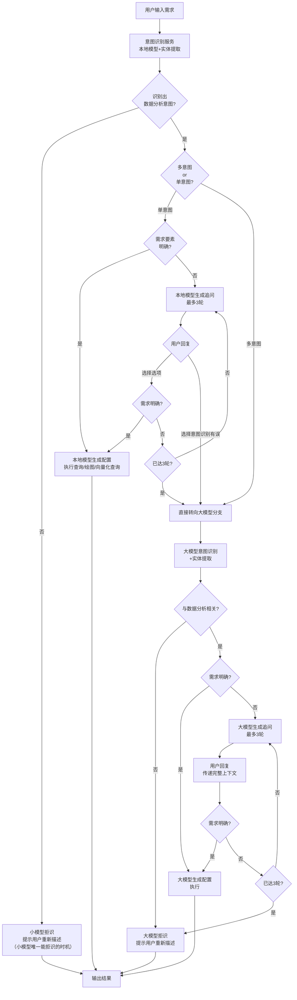
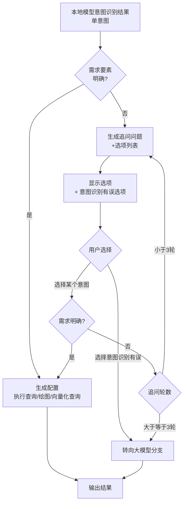
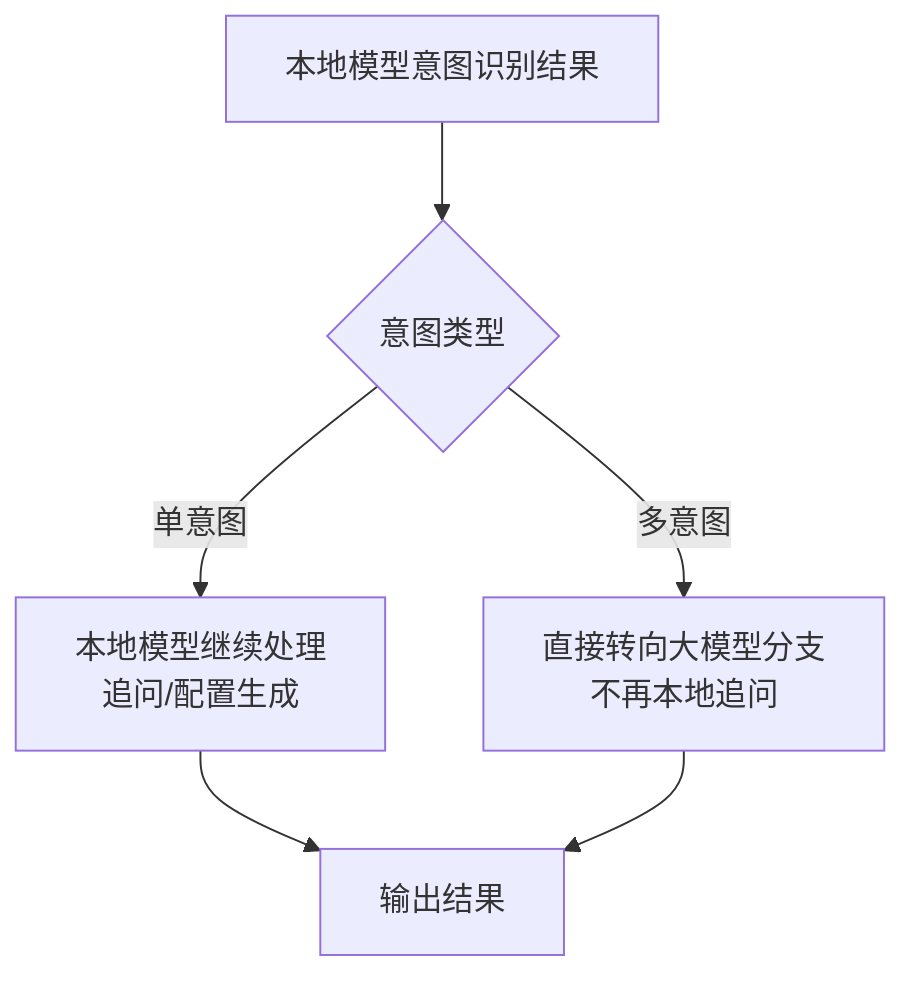
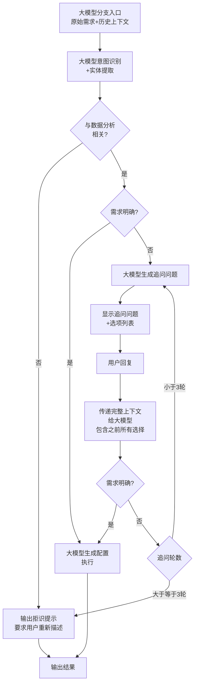
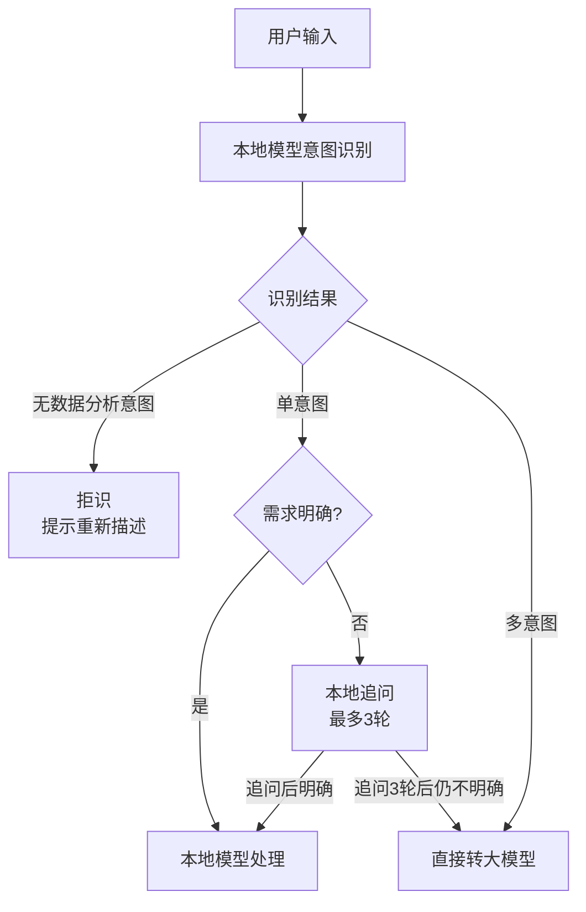
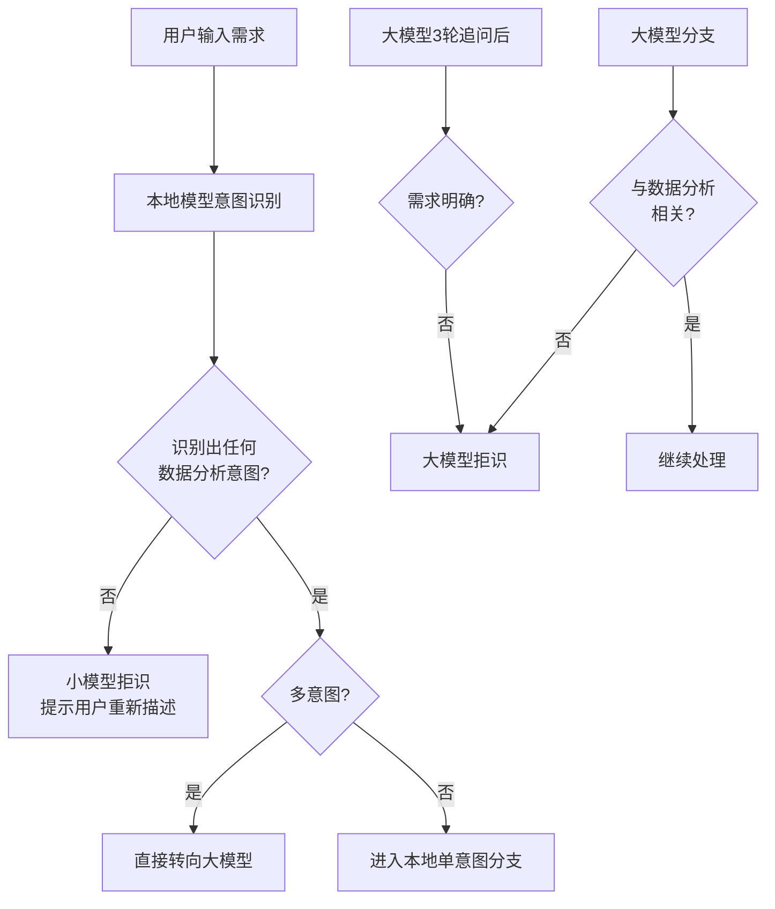
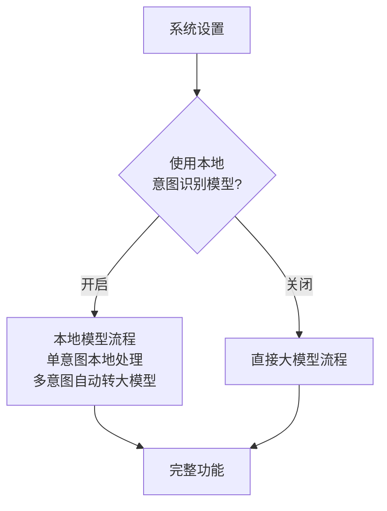

# 智能数据分析助手 - 系统流程图

> **版本：V5.0**  
> **更新日期：2026-04-02**  
> **核心变更：多意图场景统一交给大模型处理**

---

## 一、完整系统流程



---

## 二、本地模型分支详细流程（单意图）



**本地模型单意图分支处理策略：**
- 单意图场景下，本地模型可独立完成意图识别、追问、配置生成
- 当追问超过3轮仍不明确，或用户选择"意图识别有误"，才转向大模型

---

## 三、多意图处理策略（V5.0核心变更）

### 3.1 策略说明

**多意图场景统一交给大模型处理**

本地模型在处理复杂多意图场景时表现不稳定，为保障不漏掉用户需求中的复杂意图，做出以下决策：



### 3.2 多意图检测规则

系统通过以下规则检测多意图场景：

1. **组合模式检测**：
   - 统计+图表组合：`"统计各省份的平均值并绘制柱状图"`
   - 筛选+排序组合：`"筛选男性的记录，按销售额排序"`
   - 筛选+聚合组合：`"筛选华东地区，计算总和"`

2. **并列结构检测**：
   - 多个分句：`"哪个地区销售额最高，最高的是多少"`
   - 并列连接词：`"并且"、"而且"、"同时"`

3. **多操作检测**：
   - 检测到2个及以上不同类别的意图（图表类、查询类、分析类）

### 3.3 多意图直接转大模型的优势

1. **能力保障**：大模型对复杂意图的理解和拆解能力更强
2. **简化逻辑**：减少本地模型追问的复杂度，降低出错概率
3. **用户体验**：多意图通常是复杂需求，大模型能更准确地处理
4. **一致性**：复杂场景统一由能力更强的模块处理，结果更可靠

---

## 四、大模型分支详细流程



---

## 五、关键决策点说明

### 5.1 意图分类决策



### 5.2 拒识触发条件



---

## 六、系统设置流程对应



---

## 七、代码实现说明

### 7.1 修改的文件

| 文件 | 修改内容 |
|------|----------|
| `js/requirementClassifier.js` | 新增 `detectMultiIntent()` 方法；`classify()` 方法中调用多意图检测 |
| `js/script.js` | 新增 `multi_intent` 模式处理逻辑 |

### 7.2 关键代码片段

**requirementClassifier.js - 多意图检测：**
```javascript
// V5.0新增：检测多意图场景
const multiIntentCheck = this.detectMultiIntent(userInput, columns);
if (multiIntentCheck.isMultiIntent) {
    return {
        mode: 'multi_intent',
        confidence: multiIntentCheck.confidence,
        reason: multiIntentCheck.reason,
        detectedIntents: multiIntentCheck.detectedIntents,
        // ...
    };
}
```

**script.js - 多意图处理：**
```javascript
// V5.0新增：处理多意图场景
if (classification.mode === 'multi_intent') {
    addProcessingLog('info', '检测到多意图需求，自动转大模型处理');
    processingMode = 'intelligent';  // 直接转向大模型
}
```

---

## 八、多意图场景示例

### 示例1：统计 + 图表（多意图 → 转大模型）

```
用户输入: "统计各省份的销售额并绘制柱状图"

意图识别结果：
- 意图1: QUERY_AGGREGATE (统计汇总)
- 意图2: CHART_BAR (柱状图)

检测到多意图 → 直接转向大模型分支

大模型处理流程:
1. 解析两个意图：统计 + 绘图
2. 生成完整配置：先统计各省份销售额，再绘制柱状图
3. 依次执行所有意图
4. 返回结果
```

### 示例2：筛选 + 排序（多意图 → 转大模型）

```
用户输入: "筛选男性的记录，按销售额从大到小排序"

意图识别结果：
- 意图1: QUERY_FILTER (筛选)
- 意图2: QUERY_SORT (排序)

检测到多意图 → 直接转向大模型分支

大模型处理流程:
1. 解析筛选条件：性别=男
2. 解析排序规则：销售额降序
3. 生成配置：先筛选再排序
4. 执行并返回结果
```

### 示例3：单意图场景（本地模型处理）

```
用户输入: "统计各地区的销售额"

意图识别结果：
- 意图1: QUERY_AGGREGATE
  - 需求要素: 分组列=地区, 聚合列=销售额, 聚合方式=sum
  - 状态: 明确

单意图且需求明确 → 本地模型直接生成配置执行
```

---

## 九、版本变更记录

| 版本 | 日期 | 变更内容 |
|------|------|----------|
| V5.0 | 2026-04-02 | 新增多意图检测功能；多意图场景统一交给大模型处理 |
| V4.0 | - | 新增需求分类模块、智能路由功能 |
| V3.0 | - | 新增BERT模型、三层混合意图识别 |
