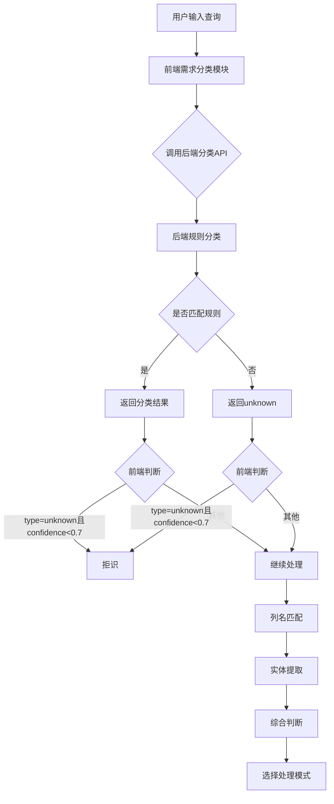

# 拒识机制流程说明

## 1. 问题描述

用户反映简单的查询如"广东省的销售额是多少"被系统拒识，同时数据向量化状态显示为"未向量化"，数据评估的完整度显示为10000%，唯一性显示为NaN%。

## 2. 拒识机制流程

### 2.1 整体流程

### 2.2 详细流程

1. **用户输入查询**：用户在聊天框中输入查询，如"广东省的销售额是多少"。

2. **前端需求分类模块**：
   - 调用`requirementClassifier.classify()`方法
   - 该方法首先调用`classifyWithBERT()`方法，向后端发送分类请求

3. **后端分类API**：
   - 后端`/api/v1/intent/classify-requirement`接口接收请求
   - 使用规则匹配进行分类，检查是否包含图表、筛选、聚合等关键词
   - 检查是否匹配"XX的YY"模式（如"广东省的销售额"）
   - 如果都不匹配，返回`{type: "unknown", confidence: 0.5}`

4. **前端判断**：
   - 前端检查返回结果，如果`type === 'unknown' && confidence < 0.7`，则拒识
   - 否则继续进行列名匹配和实体提取

5. **列名匹配**：
   - 尝试匹配用户输入中的列名
   - 使用本地匹配或API匹配

6. **实体提取**：
   - 提取用户输入中的实体，如"广东省"
   - 尝试将实体链接到数据列

7. **综合判断**：
   - 根据列名匹配度、模糊度、复杂需求等因素，选择使用本地模型还是大模型

## 3. 问题分析

### 3.1 拒识机制问题

- **现象**："广东省的销售额是多少"被拒识，理由是"输入内容与数据分析无关"，置信度0.50
- **原因**：
  1. 后端分类API使用的是规则匹配，没有真正使用BERT模型
  2. 规则匹配中，"广东省的销售额是多少"没有匹配到任何关键词
  3. 虽然有"XX的YY"模式匹配，但可能存在问题
  4. 前端判断逻辑中，当`type === 'unknown' && confidence < 0.7`时会拒识

### 3.2 数据向量化状态问题

- **现象**：数据向量化状态显示为"未向量化"
- **原因**：
  1. 向量化状态判断逻辑可能存在问题
  2. 向量集合可能没有正确创建或保存

### 3.3 数据评估显示问题

- **现象**：数据评估的完整度显示为10000%，唯一性显示为NaN%
- **原因**：
  1. 前端代码中，完整度和唯一性被错误地乘以100
  2. 唯一性计算可能存在除零错误

## 4. 解决方案

### 4.1 修复拒识机制

1. **增强后端分类规则**：
   - 优化"XX的YY"模式匹配
   - 添加更多关键词，如"是多少"、"多少"等
   - 提高匹配置信度

2. **优化前端判断逻辑**：
   - 调整拒识阈值，避免误拒
   - 对"XX的YY"模式的查询给予特殊处理

### 4.2 修复数据向量化状态

1. **检查向量化状态判断逻辑**：
   - 确保正确检查向量集合的存在
   - 优化向量化状态的更新机制

### 4.3 修复数据评估显示

1. **修复完整度显示**：
   - 移除前端代码中多余的乘以100操作

2. **修复唯一性显示**：
   - 处理除零错误，确保唯一性值正确计算

## 5. 代码修改建议

### 5.1 后端分类API修改

**文件**：`backend/app/api/v1/intent.py`

- 优化`classify_requirement`方法，增强规则匹配
- 添加更多关键词和模式，确保"广东省的销售额是多少"这样的查询能被正确分类

### 5.2 前端需求分类修改

**文件**：`js/requirementClassifier.js`

- 优化`classifyWithBERT`方法的处理逻辑
- 调整拒识阈值，避免误拒

### 5.3 前端数据评估显示修改

**文件**：`script.js`

- 修复完整度和唯一性的显示逻辑，移除多余的乘以100操作
- 处理唯一性计算的除零错误

### 5.4 前端向量化状态修改

**文件**：`script.js`

- 检查并修复向量化状态的判断逻辑
- 确保向量化状态能正确反映实际情况

## 6. 测试建议

1. **拒识机制测试**：
   - 测试"广东省的销售额是多少"等简单查询
   - 测试各种常见的数据分析查询
   - 测试与数据分析无关的输入

2. **数据向量化测试**：
   - 导入数据后检查向量化状态
   - 测试向量化后的查询功能

3. **数据评估测试**：
   - 导入数据后检查数据评估指标
   - 验证完整度和唯一性的显示是否正确

## 7. 预期效果

1. **拒识机制**：
   - "广东省的销售额是多少"等简单查询不再被拒识
   - 与数据分析无关的输入能被正确拒识

2. **数据向量化**：
   - 数据导入后向量化状态显示为"已向量化"
   - 向量化后能支持语义查询

3. **数据评估**：
   - 完整度显示为正常范围（0-100%）
   - 唯一性显示为正常范围（0-100%）
